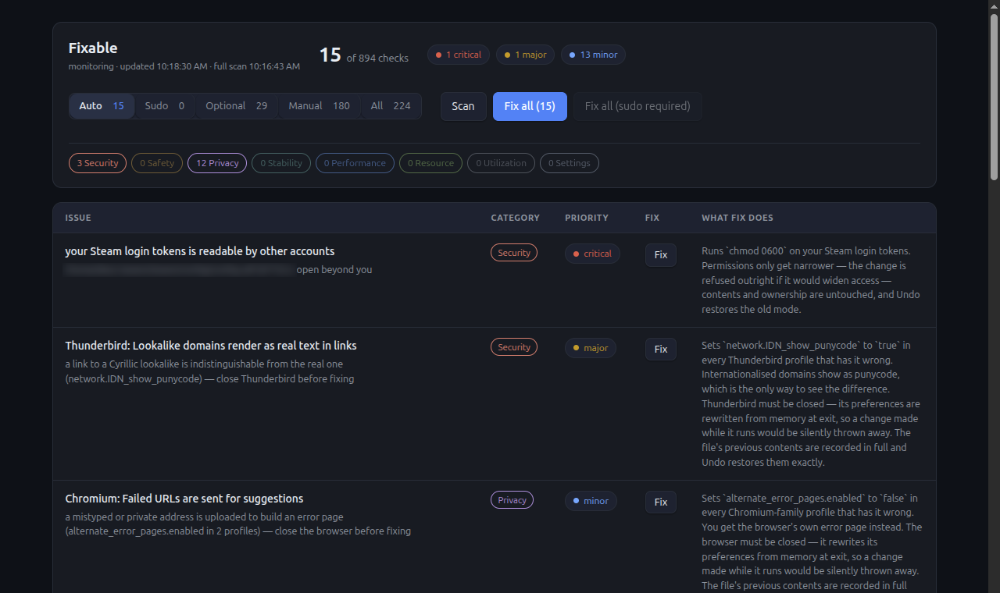

<p align="center">
  
</p>

<h1 align="center">Fixable</h1>

<p align="center">
  <b>Everything wrong with your Linux desktop, in one list — with a button next to what is safe to fix.</b><br>
  2,001 checks across security, privacy, performance, stability, resources and settings.<br>
  Runs locally as a desktop app. Nothing leaves the machine, and nothing changes unless you press something.
</p>

<p align="center">
  <code>v0.1.3</code> · <a href="LICENSE">MIT</a> · built on <a href="https://github.com/riagentic/aio">aio</a>
</p>

## Run it — one line

```sh
curl -fsSL https://raw.githubusercontent.com/riagentic/aio/main/run.sh | sh -s riagentic/fixable
```

Installs whatever is missing, clones, builds and launches.

## Or in three steps

```sh
# 1 — install the framework and its CLI
curl -fsSL https://raw.githubusercontent.com/riagentic/aio/main/install.sh | sh

# 2 — clone
git clone https://github.com/riagentic/fixable && cd fixable

# 3 — run
am fix && deno task dev
```

## What it does

Monitors the cheap things continuously; scans for everything else on demand.
Every issue names one category, one severity, and exactly what a fix would do.

Issues are split by what pressing the button costs you:

|              |                                                                                                   |
| ------------ | ------------------------------------------------------------------------------------------------- |
| **Auto**     | Runs on one click. Takes nothing away. Included in _Fix all_.                                     |
| **Sudo**     | Same bar, needs the root password. The whole batch is shown before it runs, then authorised once. |
| **Optional** | A real fix that also costs you something. Never part of any _Fix all_.                            |
| **Manual**   | No safe automatic change exists. The row says what one would have to touch.                       |

Every fix records what it replaced, and Undo puts it back.

## What it will not do

A fix never stops, restarts or reconfigures anything that is running. As root it
may only narrow a file's permissions — never widen them — or write a drop-in
file that belongs to Fixable; it never edits a file the distribution ships, and
never handles your password (the prompt is your desktop's own).

Kernel parameters that would break containers, VPNs, IPv6 or debuggers are
refused by name, with the reason, in
[`src/lib/policy/root-safe.ts`](src/lib/policy/root-safe.ts).

## Develop

```sh
deno task test      # 118 tests
deno task lint
deno task compile   # release build → dist/
```

## License

[MIT](LICENSE)
